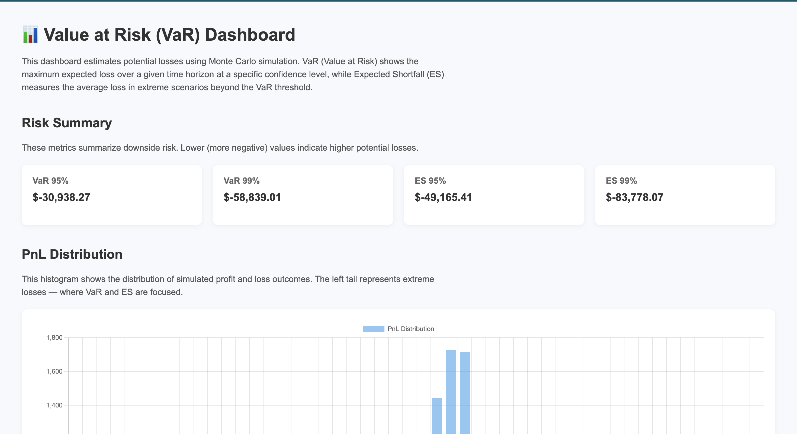
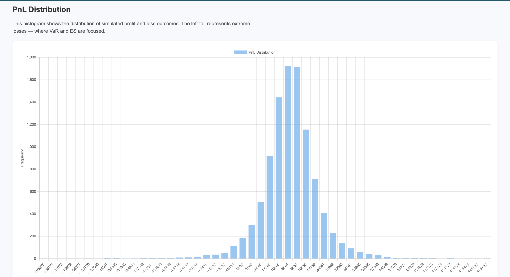

# Monte Carlo VaR Estimator

## Overview
This project implements a Monte Carlo simulation to estimate Value at Risk (VaR) for financial assets.

## Data
- Source: yfinance
- Asset: AAPL
- Frequency: Daily log returns

## Structure
- `sequential` branch: baseline implementation
- `parallel` branch: multiprocessing version (coming later)

## Demo

### Web App Preview



### Example Output

## Setup
```bash
pip install -r requirements.txt
python src/data_loader.py


